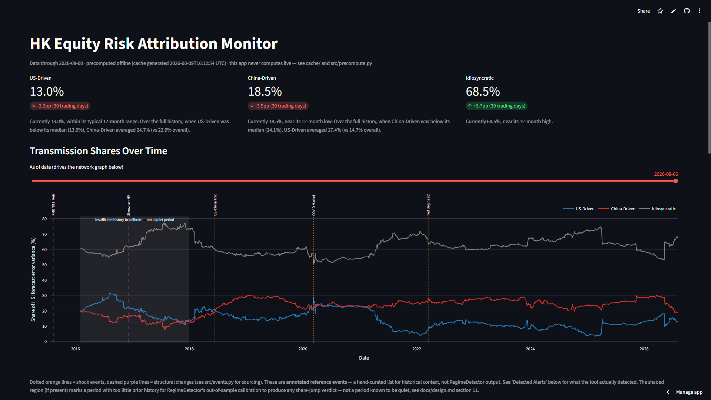
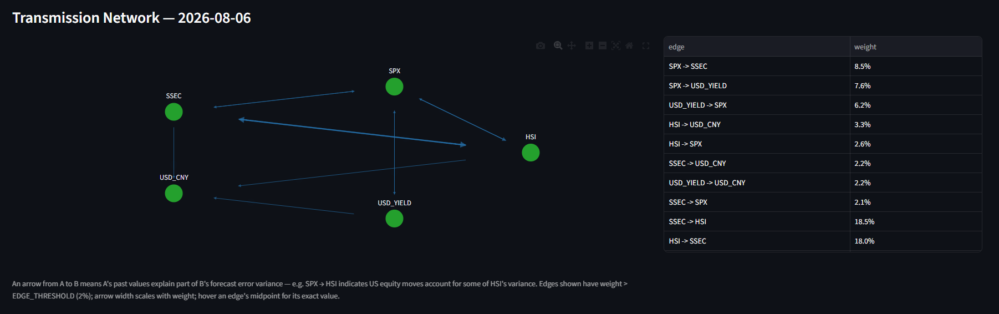

# HK Equity Risk Attribution Monitor

**[Live demo →](https://hk-risk-monitor-mdtgtfvpoqdv443jzqkicj.streamlit.app/)**

A tool that answers one question: **right now, how much of HSI's (Hang
Seng Index) risk is US-driven, how much is China-driven, and how much
is purely local idiosyncratic risk — and has that structure recently
broken?**

## Why This Exists

This is the engineering extension of the author's published paper:

> Liu, Y. (2025). Comparative Analysis of U.S. and China's Monetary
> Policy Effects on the Stability of the Hong Kong Financial Market.
> *Proceedings of the 2025 3rd International Academic Conference on
> Management Innovation and Economic Development (MIED 2025)*,
> Atlantis Press, 887–895.
> [https://doi.org/10.2991/978-94-6463-835-6_94](https://doi.org/10.2991/978-94-6463-835-6_94)

The paper (VAR + Granger causality testing on how US and China
monetary policy transmits into HK equity market stability; core
finding SPX→HSI, F=155.65, p<0.01) is static: it fits one model on ten
years of history and reports a single average transmission strength,
which tells you nothing about what's happening today specifically.
This tool is dynamic: it refits a VAR on a rolling 250-day window every
trading day, decomposing HSI's risk into US-driven / China-driven /
Idiosyncratic shares and flagging when that structure breaks.

The decision this is meant to inform: someone holding HK equity
exposure wants to know, right now, whether US or China market moves
are currently the larger driver of HSI's risk, and whether that
balance has recently shifted. This tool reports that breakdown and
flags structural changes in it — it does not evaluate or recommend any
specific hedge; whether and how to act on a given reading is a judgment
call for the person making it, informed by their own instruments,
costs, and risk tolerance.

## Screenshot





## How to Run

```bash
pip install -r requirements.txt
streamlit run app.py
```

The repository ships with a precomputed cache (`cache/`), so the app
runs immediately — it never calls yfinance/FRED or fits a VAR at
request time (see "Precompute + pinned cache" under Engineering
Decisions below).

To refresh the data: set `FRED_API_KEY` in a local `.env` (see
`.env.example`), update `DATA_END_DATE` in `src/precompute.py`, then
run `python -m src.precompute` to regenerate `cache/`.

To run the test suite (36 tests, one file per `src/` module, currently
all passing):

```bash
pytest
```

## Correctness Validation

This tool refits a VAR once on the full sample (not the rolling
windows) and runs Granger causality tests, then compares the resulting
F-statistics against the same four relationships reported in the
author's published paper (Table 3).

| Relationship | Paper F | This tool's F | p-value | Ratio | Verdict |
|---|---|---|---|---|---|
| SPX → HSI | 155.65 | 211.79 | 1.3e-47 | 1.36 | ✅ Reproduces |
| SSEC → HSI | 11.32 | 8.47 | 3.6e-03 | 0.75 | ✅ Reproduces |
| USD_YIELD → USD_CNY | 16.58 | 29.36 | 6.1e-08 | 1.77 | ✅ Reproduces |
| USD_CNY → HSI | 36.61 | 0.03 | 0.86 | 0.0008 | ❌ Does not reproduce |

*(as of `DATA_END_DATE=2026-08-08`; see `cache/metadata.json` for the
live numbers, and regenerate this table if that constant changes)*

"Reproduces" means the F-statistic is within 3x of the paper's, in
either direction, and statistically significant (p<0.05) — a
same-order-of-magnitude check, not an exact match (different data
source and sample period than the paper). 3 of 4 relationships
reproduce. USD_CNY→HSI does not, even when the sample is truncated to
the paper's exact time window; full diagnostic trail (data-quality
checks, an attempted offshore-RMB substitution) is in
[docs/notes.md](docs/notes.md). USD_CNY→HSI is treated as an
unverified channel in this tool's output.

## Architecture

```
src/
├── data_loader.py   MarketDataLoader   fetch / align_calendars / to_log_returns / check_stationarity
├── var_engine.py    RollingVAREngine   fit_window / run_rolling / validate_against_paper
├── network.py       SpilloverNetwork   one time point's transmission network (adjacency matrix)
├── detector.py      RegimeDetector     scan() / scan_out_of_sample() — structural-break alerts
├── events.py        Hand-curated reference events for the chart (not a detector output)
└── precompute.py    Orchestrates all of the above into cache/
```

Data flow: raw prices → aligned log returns → rolling VAR + GFEVD →
per-window shares and network → `RegimeDetector` alerts → `cache/` →
`app.py` reads the cache only, never computes live. Full module
responsibilities and the data-flow diagram:
[docs/design.md §1–2](docs/design.md).

## Engineering Decisions

### Trading calendar alignment: inner join, 12.9% of days lost

HK, US, and China A-share markets have different holiday calendars.
This tool keeps only days all three markets are open (inner join)
rather than forward-filling holiday prices — 390 of 3027 raw days
(12.9%) are dropped. Forward-fill was rejected because it manufactures
zero-return days that suppress volatility and bias causality tests
toward "no relationship," a fatal bias for a tool whose whole purpose
is measuring transmission strength. [docs/design.md §3](docs/design.md).

### 5 variables, not 6: CNY_YIELD dropped

The paper used 6 variables, including China's 10-year government bond
yield; this tool drops it because no stable, free, daily-frequency
data source exists for it. Stating the gap explicitly is more
defensible than forcing in a low-quality substitute.

### GFEVD, not the default Cholesky FEVD

`statsmodels`'s built-in `.fevd()` is Cholesky-orthogonalized, which
attributes all same-day covariance to whichever variable is listed
first. With HSI listed first (the fetch order), this silently
misattributed SSEC's true contribution into HSI's own "idiosyncratic"
share: China-driven read as **0.2%** on a real window, even though the
paper's own correlation table shows SSEC-HSI as the *highest* pairwise
correlation (0.542) in the entire matrix. Reordering the same window's
columns alone swung the China-driven reading between 0.2% and 28.4% —
identical data, identical model, different answer purely from column
order. Replaced with a hand-implemented Generalized FEVD (Pesaran &
Shin, 1998), which doesn't orthogonalize shocks and is therefore
order-invariant; the same window now reads China-driven ≈ **19.7%**
regardless of column order. Full diagnostic and fix:
[docs/notes.md](docs/notes.md).

### FEVD attribution grouping: USD_CNY counts as US-driven, not China-driven

The three dashboard headline numbers roll up five raw FEVD shares into
US-driven / China-driven / Idiosyncratic. USD_CNY (the RMB exchange
rate) is grouped under US-driven — `validate_against_paper()` shows
USD_YIELD→USD_CNY is a strong, verified channel (F=29.36 vs. the
paper's 16.58), meaning USD_CNY's variation is substantially a
downstream effect of US monetary policy. Counting it as China-driven
would systematically overstate China's share whenever the US channel
operates indirectly through the RMB rather than directly through SPX.
[docs/design.md §5](docs/design.md).

### SpilloverNetwork: adjacency matrix, 2% edge threshold, multiplicative path weight

The 5-node transmission network is dense and its main operation is
diffing two networks at different points in time — a numpy adjacency
matrix makes that a one-line subtraction. A raw GFEVD matrix has
almost no zero entries, so "does this edge exist" needs a threshold:
calibrated empirically at 2%, chosen so it never drops below the
historical minimum of the three paper-validated core edges while
filtering out edges dominated by noise. Indirect-path strength (e.g.
USD_YIELD→SPX→HSI) is the *product*, not sum, of edge weights, since a
two-hop path should never read as stronger than its weakest link.
[docs/design.md §4, §6, §7](docs/design.md).

### RegimeDetector: aggregate shares, two timescales, out-of-sample thresholds

The primary signal tracks the three headline shares, not the 20 raw
edges — the test applied is "if this number changes, does anyone
change what they do?" A single 5-day lookback caught COVID (a sudden
shock) but missed the 2018 trade war and largely missed the 2022
rate-hike cycle, both multi-month processes a short window
structurally can't see. So the detector runs two timescales in
parallel: **acute** (5-day, "re-evaluate the hedge now") and
**chronic** (60-day, "flag for the next periodic review"), with
consecutive same-direction crossings collapsed into one dated episode
instead of one alert per day a drift stays past threshold (this took
the chronic signal from 1572 raw daily crossings down to 37 real
episodes). Both thresholds are calibrated **out-of-sample**, once per
calendar year using only that year's prior history — resolving an
in-sample circularity where the original threshold, calibrated on the
full sample, was partly defined by the very events (like COVID) it was
later evaluated against. Verified against the original in-sample
version: same qualitative conclusions on all three known stress
periods (see Limitations for where the two versions disagree). Full
calibration trail: [docs/notes.md](docs/notes.md),
[docs/design.md §8–11](docs/design.md).

### Precompute + pinned cache, not live computation

A full rolling run (2387 windows) takes ~6 seconds — fast, but still
too slow for a slider drag to feel instant, so the tool precomputes
everything offline (`src/precompute.py`) and the frontend only reads
the cache; this also means the deployed app needs no API keys and
makes no outbound network calls. The data's end date (`DATA_END_DATE`)
is a pinned constant, not "today" — an earlier version let this drift,
and the acute threshold's full-sample calibration silently moved from
4.0pp to 3.7pp between two runs with zero code changes, meaning
nothing this project reported would have been reproducible. Updating
the data is still supported; it's a deliberate action (change the
constant, rerun, recheck the numbers in this README) instead of a
silent one. [docs/design.md §2, §12](docs/design.md).

### FEVD horizon = 10 trading days

Matches the standard horizon used in the Diebold-Yilmaz spillover
index literature (comparable to published studies, not an arbitrary
choice); ~2 calendar weeks is long enough for cross-market
transmission to play out but short enough to still describe a
"current" regime. Under the fitted VAR(1), transmission effects decay
quickly, so horizons beyond 10 produce materially the same
decomposition.

## Limitations

### USD_CNY → HSI is an unverified channel

No significant Granger causality (F=0.03, p=0.86) where the paper
reports F=36.61, holding even when the sample is truncated to the
paper's exact time window. Other Table 3 relationships reproduce at
the same order of magnitude, so this appears specific to the USD_CNY
series rather than an engine bug. Full diagnostic trail:
[docs/notes.md](docs/notes.md).

### 2016-2017 is a detection blind spot, by design

`RegimeDetector`'s share-jump thresholds are calibrated out-of-sample:
a given year's threshold only uses prior years' data, and requires at
least 252 trading days of history before it is trusted at all. This
tool's `WindowResult` series starts 2016-02-02, so 2016-2017 falls
short of that floor — this period produces **no share_jump alerts
regardless of what happened**, because the tool did not yet have
enough history to judge what counts as extreme. This must not be read
as "these years were calm"; the app's chart marks this period
explicitly rather than leaving it silently empty.

### SpilloverNetwork.EDGE_THRESHOLD is still calibrated on the full sample

Only `RegimeDetector`'s acute/chronic thresholds were addressed by the
out-of-sample fix above. This is a smaller concern than the
share-jump thresholds were: `EDGE_THRESHOLD` was calibrated from a
structural property (staying below the core paper-validated edges'
historical minimums), not a percentile of noisy tail events, so it is
less exposed to a single event defining its own bar — but it has not
been re-verified out-of-sample.

### The specific alert list is sensitive to calibration methodology

Comparing in-sample and out-of-sample calibration over the same
2015-2026 history yields the same qualitative conclusions on all three
known stress periods, but only 61% overlapping episodes at the
individual-alert level (matched by field, timescale, and overlapping
dates) — the remaining 39% appear in only one of the two versions,
concentrated in years where the calibrated threshold differs most from
the fixed full-sample value (2018, 2021). Treat individual alerts as
indicative of a real regime shift worth investigating, not as a
precise, uniquely-determined boundary. [docs/notes.md](docs/notes.md).

## Future Work

### Third-Party Capital Flow Attribution

The current model attributes HK equity risk exclusively to US and
China channels, treating everything else as idiosyncratic. In
practice, a portion of that residual likely reflects non-US/non-China
capital flows — European and Japanese allocators, Middle East
sovereign funds, global risk-off rotations — for which Hong Kong
serves as a liquid access point. Idiosyncratic risk is, by definition,
un-hedgeable within the current framework; if a meaningful share of it
is actually driven by identifiable third-party flows, it becomes
hedgeable. Proposed approach: introduce third-party proxies (STOXX 50
/ Nikkei 225, gold and JPY, CNH-CNY spread) and test whether they
explain a statistically meaningful share of the current idiosyncratic
residual.

### Offshore CNH as the USD_CNY Replacement

Offshore CNH is conceptually the more appropriate measure for this
tool — it trades in Hong Kong and shares the same investor base as HK
equities, whereas onshore CNY is subject to PBOC central parity
management. Substituting CNH would require a paid data source
(Bloomberg, Refinitiv, CEIC); no free provider tested offers daily
historical CNH spot.

### FX as a Separate Fourth Attribution Category

The current grouping folds USD_CNY into US-driven alongside SPX and
USD_YIELD ([docs/design.md §5](docs/design.md)). A more granular
decomposition would split FX into its own fourth category rather than
merging the rates and FX channels together — not implemented in order
to keep the dashboard to three headline numbers.

### Sample Start Date and Extending the History

This tool's sample starts in 2015 — not a data-availability limit, but
because the market structure it measures didn't exist in its current
form before then: Stock Connect launched in phases (Shanghai-HK,
November 2014; Shenzhen-HK, December 2016), and the August 2015 "811"
RMB reform changed how USD_CNY is set. Extending further back (e.g. to
include 2008) would give threshold calibration more independent
extreme events to work with, but would require treating pre/post-2015
as structurally distinct regimes rather than pooling them into one
rolling window.

### Out-of-Sample Calibration for EDGE_THRESHOLD

`RegimeDetector`'s thresholds are now calibrated out-of-sample (see
Engineering Decisions); `SpilloverNetwork.EDGE_THRESHOLD` was not part
of that fix and remains calibrated on the full sample. Extending the
same expanding-window approach to it is the natural next step, though
it calibrates differently (a structural margin below core edges'
minimums, not a percentile), so the method would need adapting rather
than reusing `RegimeDetector`'s calibration functions directly.

## Project Structure

```
hk-risk-monitor/
├── app.py                Streamlit frontend (read-only, reads cache/ only)
├── src/
│   ├── data_loader.py     MarketDataLoader
│   ├── var_engine.py      RollingVAREngine
│   ├── network.py         SpilloverNetwork
│   ├── detector.py        RegimeDetector
│   ├── events.py          Reference-event list (not a detector output)
│   └── precompute.py      Offline pipeline -> cache/
├── tests/                 pytest, one file per src/ module
├── docs/
│   ├── design.md           Every non-obvious design decision, with rationale
│   └── notes.md            Diagnostic trails, bugs found and fixed, calibration history
├── cache/                  Committed to git: rolling_results.parquet, alerts.parquet, metadata.json
└── requirements.txt
```
